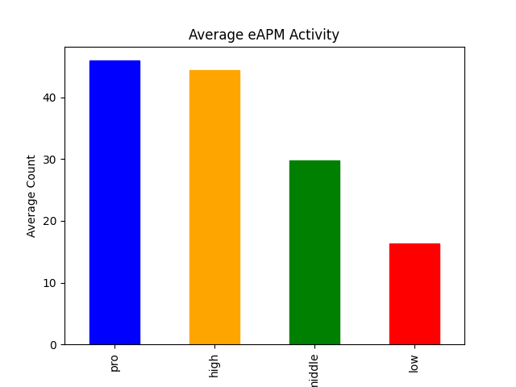
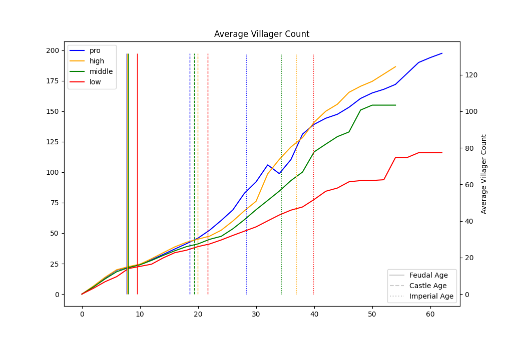
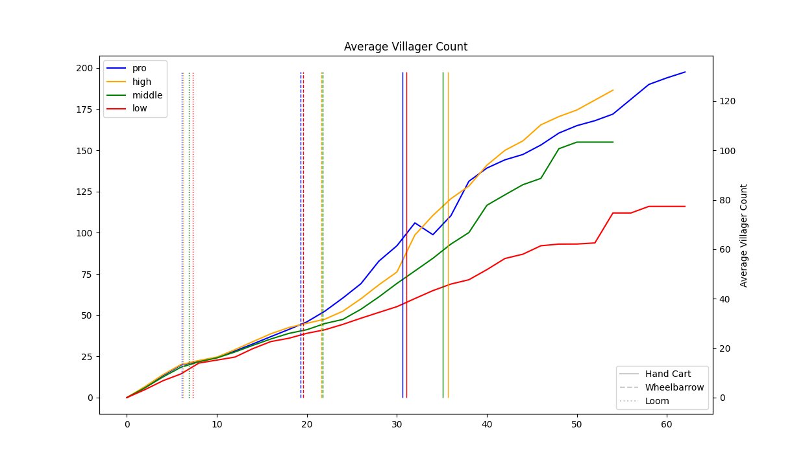
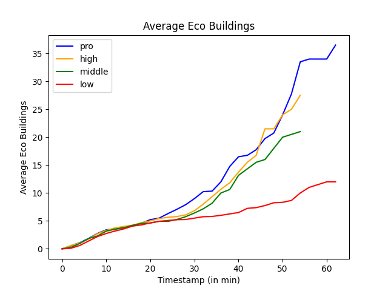
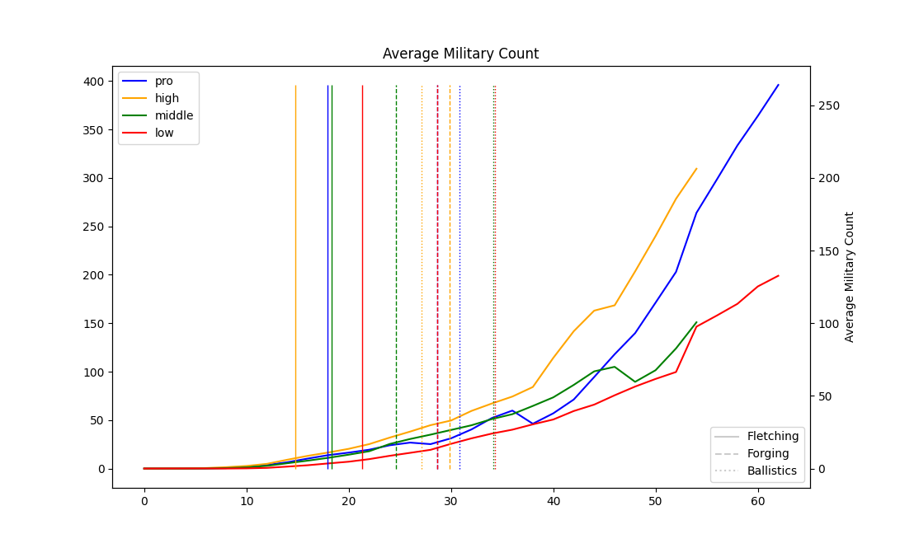
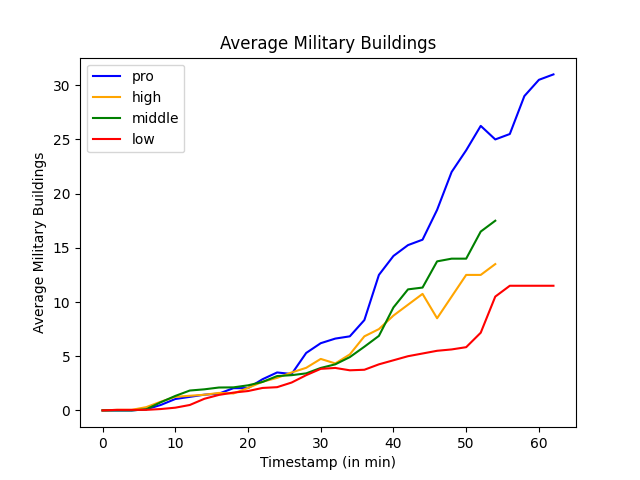
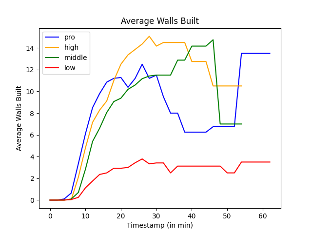
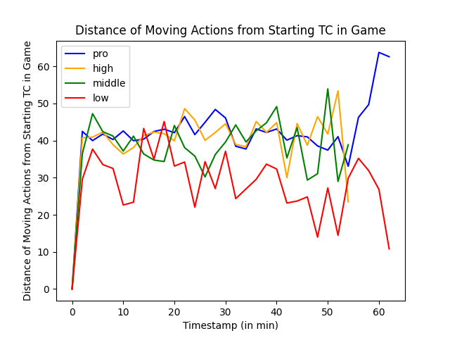
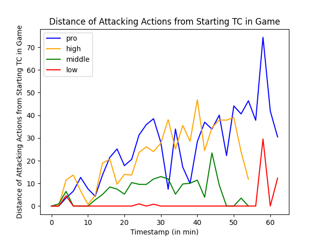
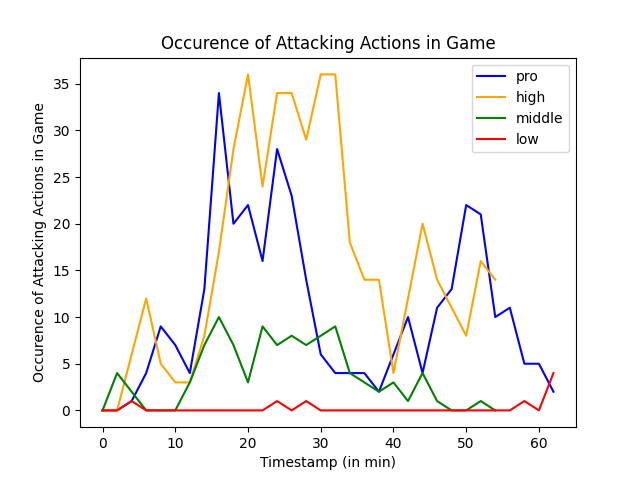

# Project Summary
By visualising AoE II DE data based on skill level I wanted to answer the following question:

_Which aspects make people more skilled in AoE II DE?_

And more importantly: _How can players improve?_

For this I analysed ten replays of 1:1 Arabia games per skill bracket (ELO):
- _PRO_ (>2200)
- _HIGH_ (>1800)
- _MIDDLE_ (>1000)
- _LOW_ (≤1000)

Arabia was selected since its map design has the least effect on gameplay.

There a several aspects in AoE II DE which define skill level - similar to other RTS like Starcraft II: Resource gathering, military production, movement and attacking on the map and technology research, amongst many other aspects. These actions can be summarised in an "eAPM" count, effective action per minute.

Based on the analysis, the eAPM numbers corresponded with their corresponding skill levels. However, they need to be executed in an efficient manner to be successful - a high eAPM does not automatically imply higher skill level. This includes micro and macro- management of units and a low Town Centre (TC) idle time (villager production).

## Resource Gathering & Villager Production
It can be said that the higher the skill level, the higher the number of villagers that are produced. An exponential grows in villagers can be seen for the skill bracket _PRO_. This can be linked to the research of Castle Age and the ability to build additional TC. An increase in villager production could also be seen for the other skill levels, in particular _HIGH_, but not to that extent. Only _PRO_ and _HIGH_ show an exponential development of villager production. Due to higher villager numbers, the average research time for Imperial Age was also the lowest for the _PRO_ bracket.

_Wheelbarrow_ and _Hand Cart_ are technologies which improve the efficiency of villager gathering and their speed. Due to their initial cost and TC idle time, the research time of these technologies should be chosen carefully. _LOW_ skill bracket researched the technologies around the time of the _PRO_ bracket - with the least number of average villagers. In the _PRO_ bracket _Wheelbarrow_ was researched around the time Castle Age was finished researching. _Hand Cart_ was researched around the time the exponential production of villager flattened. A similar observation could be made for the _HIGH_ skill bracket.

In conclusion it can be said that _PRO_ players are aware of when to best research economy upgrades and to not idle their TC. Villager production is key for quick age advances and better and more efficient resource gathering. _PRO_ players are also more efficient in following up building of economy buildings to increase villager efficiency. Less walking time implies that resources are gathered more efficiently.

    
    

## Economy Buildings
Regarding the number of economy buildings built, numbers are relatively even amongst the different brackets up until ~25min. This can be related to players following certain build orders. Around this time, the number of buildings increases exponentially for the _PRO_ bracket. This can be attributed to _PRO_ players re-building lumber and mining camps to decrease walking time for their villagers as well as support the increasing number of villagers. Coincidentally, this is also the average time Imperial Age is researched. A similar increase can be seen for _HIGH_ and _MIDDLE_ around ~30min.

## Military Production & Technologies
Military production is tightly linked to resource gathering. The more resources there are available, the more military can be produced. The more military production buildings are built, the quicker military can be produced. Based on the analysis results, military production developed somewhat exponentially for both _PRO_ and _HIGH_, the other two brackets lacked far behind.

Similar to the economy buildings, up until ~20min, the building count was similar amongst the different skill brackets. The _PRO_ skill bracket ended building the most military buildings by a large margin. The other skill brackets featured similar counts. The military count increased exponentially for the _PRO_ bracket around the same time an exponential growth of military buildings could be observed. The selected technologies for the military count visualisation focused on increasing attack power of both melee and ranged units. There, a significance difference amongst the skill brackets could not be seen.

To summarise, more military buildings should be built to increase military production given the player's economy supports it.

    
    

## (Quick-) Walling
Walling is used in open maps to protect against raids. The technique quick walling is used when villagers are being attacked and they quickly build palisade walls to protect against the attack. Based on the analysis results, it can be said that in the _PRO_ and _HIGH_ bracket, a significantly higher number of walls is built. It can also be seen that quick walling, a rapidly executed, highly skill-dependent technique to temporarily protect villagers from approaching threats, is utilised based on the jump around ~25min for both _HIGH_ and _PRO_ brackets.

## Player Movement & Attacking Patterns
Moving around the map is essential for scouting and attacking. Actions with a high distance from a player's base can indicate an attack on the opponent or scouting. Moving across the map does not seem to be significantly affected by skill level: _PRO_, _HIGH_ and _MIDDLE_ players roughly move the same across the map. However, it should be noted that the _PRO_ bracket fluctuates the least. Indicating that they are successfully microing their units in the opposing base.

When analysing the distance of attacking actions in the _PRO_ bracket, attacks tend to happen in both bases simultaneously. In comparison, they happen more in the centre of the map for the _HIGH_ skill bracket. The _MIDDLE_ bracket shows that all units tend to be lost in a fight, explained by the large dip in actions. The _LOW_ bracket shows the least amount of military movement.

Taking the graph with the occurrence of attacking actions into account, the spike of actions for the _HIGH_ and _PRO_ skill brackets can be explained by an effort to micro attack units. Such a spike cannot be seen for the other skill levels. However, it should be noted that it could also be explained by players pressing attack rapidly in succession.

In conclusion, _PRO_ players tend to raid opponents by sending military units into the opponent’s base rather than facing them head-on in the middle of the map. This behaviour should be adapted by the other skill brackets in order to weaken their opponent more effectively.

    
    
    

## Summary
To summarise, the following are the main differences and similarities between higher skilled and lower skilled players:
* Key Differences
    * More actions
    * Raiding
    * Effective villager production
    * Keeping distance between villagers and drop-off points to a minimum by constantly rebuilding drop-off buildings
    * More military buildings
    * Knowing when to upgrade, prioritise economy vs. military development
    * Quick age-up times
    * (Quick-)Walling
    * Microing units
* Similarities
    * Build orders
    * Scouting